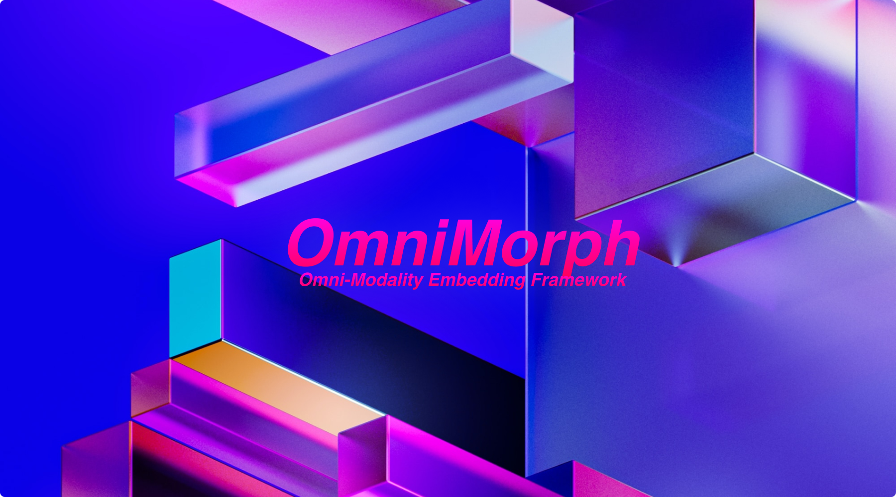

# OmniMorph: 📐 Omni Modality Embeddings Framework



Discover the future of data transformation with OmniMorph, a cutting-edge, omni-modality embedding function designed to seamlessly handle and adapt to diverse data inputs. OmniMorph intelligently detects and optimizes embeddings for various modalities, revolutionizing data processing while saving valuable time and resources. Its unparalleled adaptability empowers users to efficiently work with multi-modal data, unlocking new possibilities for AI research and development.

## 🔹 Features

- Omni-modality embedding function
- Intelligent detection and optimization of embeddings for various modalities
- Accelerated data processing and resource management
- Unlocks new possibilities for AI research and development

## 📦 Installation

```bash
pip install omnimorph
```

## 🚀 Quick Start

```python
import torch
from omnimorph import OmniMorph

omni_morph = OmniMorph()

text_data = torch.randint(0, 10000, (10, 50))
vision_data = torch.randn(10, 3, 224, 224)
audio_data = torch.randn(10, 1, 16000)

text_embeddings = omni_morph(text_data)
vision_embeddings = omni_morph(vision_data)
audio_embeddings = omni_morph(audio_data)
```

Check out the [examples](./examples) folder for more detailed usage and code examples.


## Examples

### Basic Usage

Here's a simple example of how to use OmniMorph with text, image, and audio inputs:

```python
import torch
from omni_morph import OmniMorph

omni_morph = OmniMorph()

text_input = torch.randint(0, 10000, (1, 50))
image_input = torch.randn(1, 3, 224, 224)
audio_input = torch.randn(1, 128, 100)

text_embedding = omni_morph(text_input, user_defined_modality='text')
image_embedding = omni_morph(image_input)
audio_embedding = omni_morph(audio_input)
```

### Custom Modality Detection

You can provide your own modality detection function to handle custom data formats:

```python
def custom_modality_detector(input_data):
    # Add custom logic to detect input data modality
    return "custom_modality"

embedding = omni_morph(custom_input, custom_modality_fn=custom_modality_detector)
```

### User-Defined Modalities

To add a user-defined modality, register the corresponding embedding class and instantiate the embedding:

```python
omni_morph.register_and_instantiate("custom_modality", CustomEmbeddingClass, **kwargs)
```

Then, you can use the custom modality when generating embeddings:

```python
embedding = omni_morph(custom_input, user_defined_modality="custom_modality")
```

### Fusion Techniques

Register a fusion technique to combine embeddings in a specific way:

```python
def custom_fusion(embedding):
    # Add custom logic to fuse the embedding
    return fused_embedding

omni_morph.register_fusion_technique("custom_fusion", custom_fusion)
```

Apply the registered fusion technique when generating embeddings:

```python
fused_embedding = omni_morph(input_data, fusion_technique="custom_fusion")
```


## 📚 Documentation

For more in-depth information on how to use OmniMorph, please refer to the [documentation](https://github.com/kyegomez/OmniMorph/wiki).

## 🤝 Contributing

We welcome all contributions to improve OmniMorph! Please check out the [contributing guide](./CONTRIBUTING.md) for guidelines on how to proceed.

## 📃 License

OmniMorph is released under the [MIT License](./LICENSE).

## 🤗 Support

For any questions, issues, or suggestions, feel free to open an issue on our GitHub repository or reach out to us through our [community forum](https://github.com/kyegomez/OmniMorph/discussions).

Join the OmniMorph revolution and experience the future of data transformation today! 🎉


## Conclusion

OmniMorph is a powerful and flexible solution for working with multimodal data, making it easy to generate embeddings for various data types through a unified interface. By simplifying the process of handling different data modalities, OmniMorph enables researchers and engineers to focus on their core tasks and accelerate their work.


# Join Agora

Agora is a community of brave Humans who seek to make a real change in the world for the Advancement of Humanity